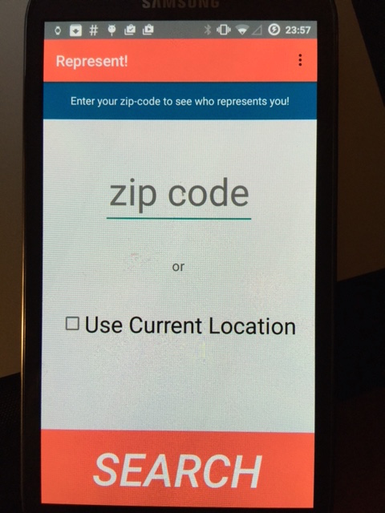
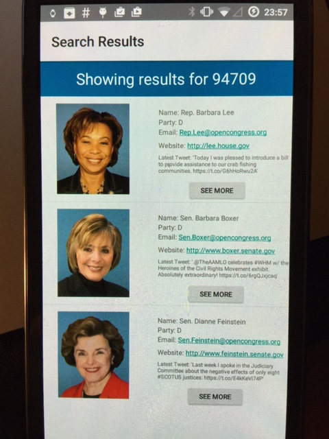
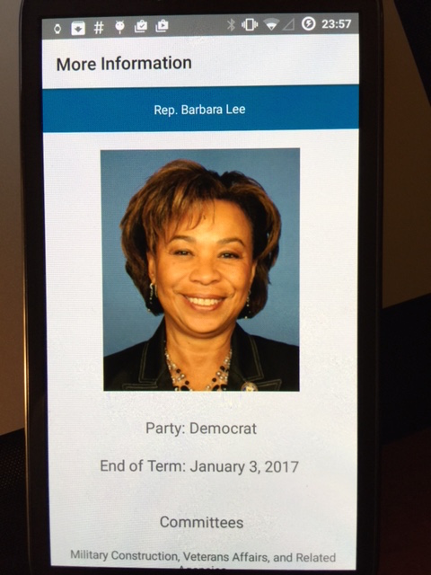
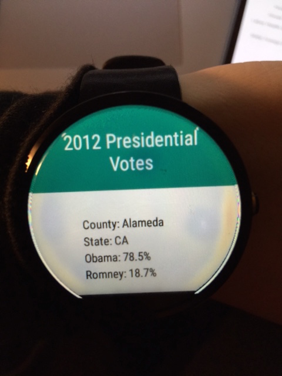

# PROG 02: Represent!

Your “go-to” application for election information!  

## Authors

Ekaterina Stukalova ([katya.stukalova@berkeley.edu](mailto:your_email@berkeley.edu))

## Demo Video

See [Represent!] (https://link_to_your_video) in action!

## Screenshots
Home Screen:  
The welcome screen. User can clearly see the two ways that they can search for candidates. The text at the top is meant to allude to what the search results will be for new users. The “Search” button is italicized to make it more clear that it is a button.  
  
  
  
Search Results: Mobile  
After entering a zip code the user is brought to this screen. The three representatives are clearly visible and the “See More” button is prominently positioned near the candidate it corresponds to. In the previous iteration of the project there was significantly less space between the “Email” and “Website” fields, leading to the “Fat Finger Problem”.  
  
  
  
Search Results: Watch  
At the same time, the user can view three of the representatives on the watch. They scroll horizontally to view more candidates. Pressing on the green portion of the screen reveals the “Detail” view on the mobile device.  

  
  
 Detail View  
 The user can access more information about each of the representatives either from the results page on the mobile device, or by pressing on the selected candidate on the watch.  
The Committees and and Bills sections are formatted slightly differently to draw attention to the reader's eye that the sections are different.  

  

  
  
2012 Election Results  
Tapping the “2012 Election” bar at the top of the default watch screen will let the user see the results of the 2012 election for the county of the representative displayed on the watch. The information and the screen are clearly labeled.  
  
  

## Acknowledgments

Thank you to the following sources:  
  
  https://twittercommunity.com/t/test-run-with-fabric-android/60673  

  http://stackoverflow.com/questions/28541459/getting-403-forbidden-when-using-twitter-fabric-to-get-user-timeline  
  
  http://developer.android.com/training/wearables/apps/bt-debugging.html  

  https://gist.github.com/dryan/7486408#file-valid-zips-json  

